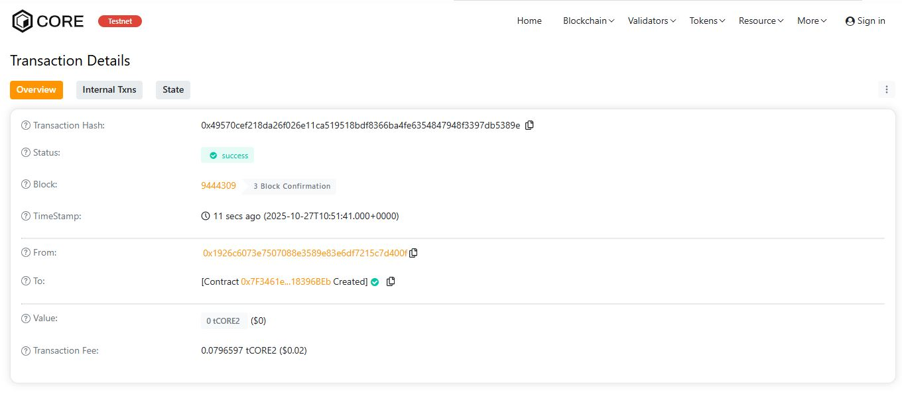

# Project_126
DappFusion** is a decentralized application registry that enables developers to **publish**, **update**, and **retrieve** metadata for their DApps on-chain.

---

## 🌍 Project Vision
To create a **unified decentralized hub** for DApp registration and discovery, ensuring trust, transparency, and collaboration within the blockchain ecosystem.

---

## 🔑 Key Features
- **DApp Publishing:** Developers can register their DApps on-chain.  
- **Secure Updates:** Only the DApp owner can update its metadata.  
- **Immutable Records:** Every DApp entry is timestamped and permanently stored.  
- **Event Logging:** Each publish and update emits an event for tracking.  
- **Open Verification:** Anyone can retrieve and verify a DApp’s authenticity.

---

## 🔭 Future Scope
- **IPFS Integration** for decentralized document or logo storage.  
- **DApp Verification Badges** for trusted developers.  
- **Token-based Rewards** for community participation.  
- **Analytics Dashboard** for DApp trends.  
- **Cross-chain Registry** for interoperability.

---

## ⚙️ Tech Stack
- **Solidity (v0.8.x)**  
- **Hardhat (Smart Contract Framework)**  
- **Ethers.js (Interaction Library)**  
- **Ethereum / EVM-compatible networks**

---

## 📄 License
MIT License © 2025 DappFusion

H address:0x49570cef218da26f026e11ca519518bdf8366ba4fe6354847948f3397db5389e

